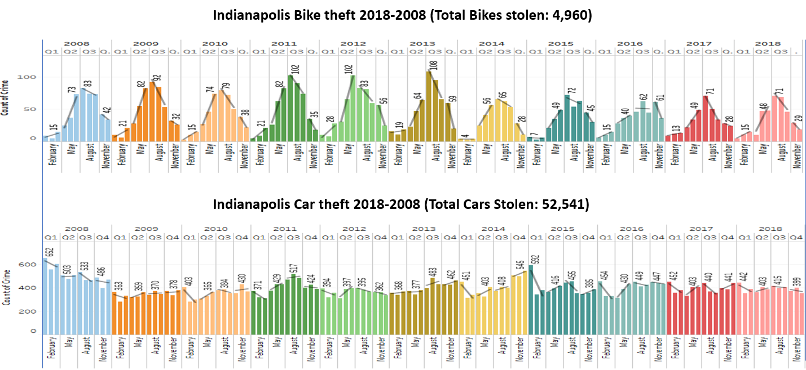

# 
Where Did My Bike Go? 

# Can Bike theft be predicted?

Between 2018 and 2008,  almost 5 thousand bikes were stolen in Indianapolis according to public records (fig A). Additional data can be extracted to identify where (one of six distirts defined by IMPD) and when bikes are taken in Marion county. After compiling bike theft data from the 2018 to 2008 time period the following trends can be observed:

- The months May through September have a significantly higher rate of theft then colder months. 
- Bike theft reported is highest between 12:00 A.M. and 12 P.M 
- Consistent peak around 7:00 P.M.
- These trends are consisitent regardless of month or year. 

### Proposal:
Can a model be constructed using date, time, and weather conditions  to predict which poice district of Indianapolis will have a higher risk for bike theft?

## Bike theft during the 24 hour period (Data range 2018-2008).

Contrasting bike and car theft over the same period demonstrates a possible seasnal pattern that may be useful for modeling data. 

### Process (in progress): 
- [ ] Concept design and project planning.
- [ ] Create Github Repository.
- [ ] Evaluate and obtain data sources.
- [ ] Create databases to archive data.
  - [ ] Create SQL database
  - [ ] Create SQL lite database
  
- [ ] Develop a Python Flask application to create API's enabling users to explore data. 
- [ ] Generate a website with instructions for users to access API's and website content.
- [ ] Design additional web pages containing analysis, charts, interactive experiences, and data allowing users to investigate correlations between team salaries and outcomes.

### Resources (in progress):
-	HTML/CSS
-	JavaScript
-	JavaScript library
	-	[ECMAScript Internationalization API](https://402.ecma-international.org/1.0/) 		
-	Python
-	SQL
-	SQL lite

### Data Sources:
1. [IMPD_UCR_data](https://data.indy.gov/search?q=ucr&tags=ucr)
      
  OpenIndy host the data from Uniform Crime Report (UCR) program administered by the federal government in which crime statistics from across the country are reported to the FBI in a uniform manner based on crime definitions determined by the FBI. UCR Part 1 crime groups are murder, rape, robbery, aggravated assault, burglary, larceny, and vehicle theft.
        		
	

	
	
	
   2. [Kaggle: City weather](https://www.kaggle.com/selfishgene/historical-hourly-weather-data)
      
  Kaggle Data dataset containing ~5 years of high temporal resolution (hourly measurements) data of various weather attributes, such as temperature, humidity, air pressure, etc. This data is available for 30 US and Canadian Cities, as well as 6 Israeli cities.
  

### Data Preperation:

### Data Modeling:
A Random Forest, SVC (with GridSearch), and Neural Network models were created to identify exoplanets identified by the Kepler Space Observatory. Each model employed the primary dataset described above. In addition to the primary data set, an additional Random Forest model was created using the dataset generated from the MinMaxScaler. This model did not show a significant difference and was not reported.  The SVC model was optimized by using a rbf kernel. GridSearch was also employed to further tune the model. The optimized parameters were: C, 50, gamma, and 0.0005. The Neural Networks model employed Keras. A MinMaxScaler function was also used in preprocessing the data. Each model was saved under the prefix z#_  after completion.

### Review
Analysis of each mode was conducted and reported below. 

|Model|Model Score|Training Score|
|-----|-----------|--------------|
|Random Forest  |0.25|0.995 |
|SVC(GridSearh Score)|  0.24|0.29|
|Neural Network|  0.27|N.A.|

Additional analysis of each mode was conducted. Precision data was also evaluated with respect to  koi_disposition ( Candidate, Confirmed, False Positive) for the Random Forest and SVC models. The coresponding values for the Neural Netwroks Score were not obtained. 

|Model|koi disposition|Score|recall|f1-score|Support|
|-----|---------------|-----|------|--------|-------|
|Random Forest|Down Town|0.98|1.00|0.99|853|
|SVC|Down Town|0.96|0.98|0.97|853|
|Random Forest|Norht District|0.80|0.73|0.77|411|
|SVC|Norht District|0.83|0.69|0.75|411|
|Random Forest|Confirmed CANDIDATE|0.79|0.83| 0.81|484|
|SVC|Confirmed CANDIDATE|0.78|0.86|0.82|484|

|Model|IMPD District|Score|recall|f1-score|Support|
|-------------|--|----|----|----|---|
|Random Forest|DT|0.26|0.83|0.39|121|
|Random Forest|ND|0.00|0.00|0.00|81|
|Random Forest|NE|0.22|0.27|0.24|104|
|Random Forest|NW|0.00|0.00|0.00|62|
|Random Forest|SE|0.00|0.00|0.00|81|
|Random Forest|SW|0.00|0.00|0.00|64|
