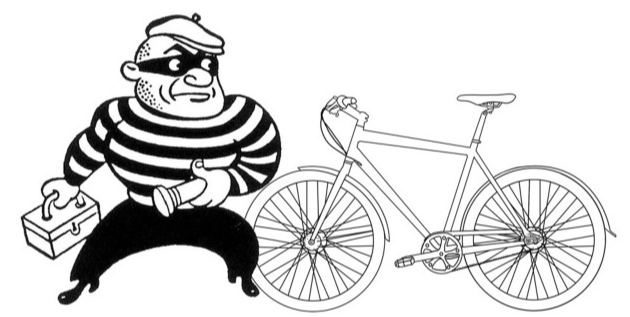

# 
Where-is-my-BIke 

# Can Bike theft be predicted?

Between 2018 and 2008 4,960 bikes were stolen in Indianapolis according to public records (fig A). Additional data can be extracted to identify where and when bikes are stolen in Marion county. The months May Through September have a significantly higher rate of theft then colder months. This information coupled with weather data may enable the ability to identify areas of  Indianapolis that have a higher risk for theft.

2018-2008 Bike Theft by year (fig A)

2018-2008 Bike Theft by month (fig B)
![bike_theft_monthly.png(bike_theft_monthly.png)
