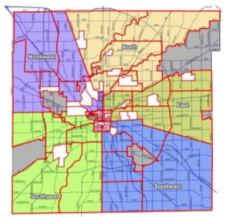
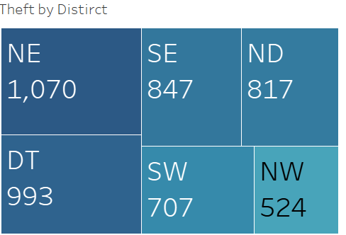

# 
Where Did My Bike Go? 

# Can Bike Theft Be Predicted?

Between 2008 and 2018 approximately 5 thousand bikes were stolen across the six police districts of Indianapolis (fig A). Additional data can be extracted from public records to identify where and when bikes are reported stolen in Marion county. After compiling bike theft data over a ten-year time period (2008 to 2018) the following trends can be observed:

- May through September have a significantly higher rate of theft then colder months.
- July has the highest reported theft regardless of year. 
- Bike theft reported is highest between noon and midnight.
- Consistent peak around 7:00 P.M. regardless of year or month.

## Proposal:
Can a model be constructed using date, time, and weather conditions  to predict which police district of Indianapolis will have a higher risk for bike theft?

### Bike theft during the 24 hour period (Data range 2008-2018).

Contrasting bike and car theft over the same period demonstrates a possible seasonal pattern that may be useful for modeling data.

### Police Districts of Indianapolis
Downtown (DT-Red), North District (ND-Yellow), North East District (NE-Grey and olive. Two sections), North West District (NW-Purple), South East District (SE-Blue), and South West District (SW-Lime).

# Process (in progress): 
- [ ] Concept design and project planning.
- [ ] Create Github Repository.
- [ ] Evaluate and obtain data sources.
- [ ] Create databases to archive data.
  - [ ] Create SQL database
  - [ ] Create SQL lite database
  
- [ ] Develop a Python Flask application to create API's enabling users to explore data. 
- [ ] Generate a website with instructions for users to access API's and website content.
- [ ] Design additional web pages containing analysis, charts, interactive experiences, and data allowing users to investigate correlations between team salaries and outcomes.

# Resources (in progress):
-	HTML/CSS
-	JavaScript
-	JavaScript library
	-	[ECMAScript Internationalization API](https://402.ecma-international.org/1.0/) 		
-	Python
-	SQL
-	SQL lite
-	Machine learning models(TBD)

# Data Sources:
1. [IMPD_UCR_data](https://data.indy.gov/search?q=ucr&tags=ucr)
      
  [OpenIndy](https://data.indy.gov/) host the data from Uniform Crime Report (UCR) program administered by the federal government in which crime statistics from across the country are reported to the FBI in a uniform manner based on crime definitions determined by the FBI.
        		
	

	
	
	
   2. [Kaggle: City weather](https://www.kaggle.com/selfishgene/historical-hourly-weather-data)
      
  Kaggle Data dataset containing ~5 years of high temporal resolution (hourly measurements) data of various weather attributes, such as temperature, humidity, air pressure, etc. This data is available for 30 US and Canadian Cities, as well as 6 Israeli cities.
  

# Data Preparation:
Data was collected from the sources above in CSV format. UCR data was concatenated and reformatted. Dates and times were divided into separate features. Weather data was reformatted in a similar fashion. Data descriptions were updated. UCR and weather data was then joined into the following format listed below. 

Data over a five year period was evaluated (2012-2017). CRIME, weather description (Description) and District data were transformed employing one-hot encoding. Districts was selected as the output variable. An initial random forest model was applied to identify key features. Final features were determined by this data.

|Rank|Signifigance|Feature|
|----|------------|-------|
|1|0.122947|Temp(K)|
|2|0.111011|Humidity%|
|3|0.104794|DATE_day|
|4|0.100514|Pressure(atm)|
|5|0.100086|Hour|
|6|0.089126|DATE_week|
|7|0.087968|Minute|
|8|0.068030|wind|
|9|0.067276|Description|
|10|0.054805|DATE_month|
|11|0.054789|DATE_year|
|12|0.038654|Bike Value|

# Data Modeling:
A Random Forest, SVC (with GridSearch), and Neural Network models were created to identify which police district of Indianapolis would most likely have a bike theft bassed on date, time, and weather conditions. Each model employed the primary dataset described above. In addition to the primary data set, an additional Random Forest model was created using the dataset generated from the MinMaxScaler. This model did not show a significant difference and was not reported.  The SVC model was optimized by using a rbf kernel. GridSearch was also employed to further tune the model. The optimized parameters were: C, 50, gamma, and 0.0005. The Neural Networks model employed Keras. A MinMaxScaler function was also used in preprocessing the data. Each model was saved under the prefix z#_  after completion.

# Model Review
Analysis of each model was conducted and reported below. 

|Model|Model Score|Training Score|
|-----|-----------|--------------|
|Random Forest  |0.25|0.995 |
|SVC(GridSearh Score)|  0.24|0.29|
|Neural Network|  0.27|N.A.|

Additional model data was also evaluated with respect to each Police district (Downtown (DT), North District (ND), North East District (NE), North West District (NW), South East District (SE), and South West District (SW)) for the Random Forest and SVC models. The corresponding values for the Neural Networks Score were not obtained.

|Model|IMPD District|Precision|recall|f1-score|Support|
|-------------|--|----|----|----|---|
|Random Forest|DT|0.32|0.58|0.41|121|
|Random Forest|ND|0.24|0.12|0.16| 81|
|Random Forest|NE|0.25|0.36|0.29|104|
|Random Forest| NW|0.08|.03|0.05|62|
|Random Forest|SE|0.20|0.09|0.12|81|
|Random Forest|SW|0.13|0.08| 0.10|64|

|Model|IMPD District|Precision|recall|f1-score|Support|
|-------------|--|----|----|----|---|
|SVC|DT|0.26|0.83|0.39|121|
|SVC|ND|0.00|0.00|0.00|81|
|SVC|NE|0.22|0.27|0.24|104|
|SVC|NW|0.00|0.00|0.00|62|
|SVC|SE|0.00|0.00|0.00|81|
|SVC|SW|0.00|0.00|0.00|64|

# Conclusion

Modeling is inconclusive. Project requires additional considerations.
